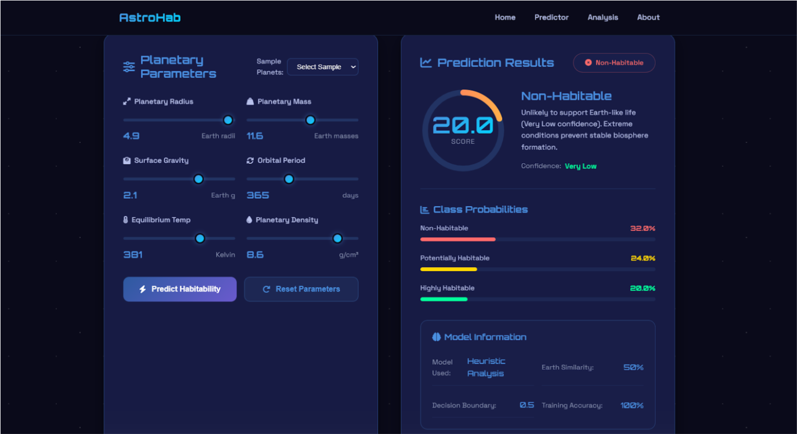
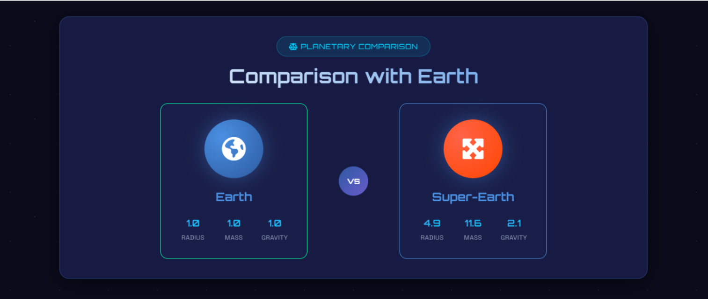
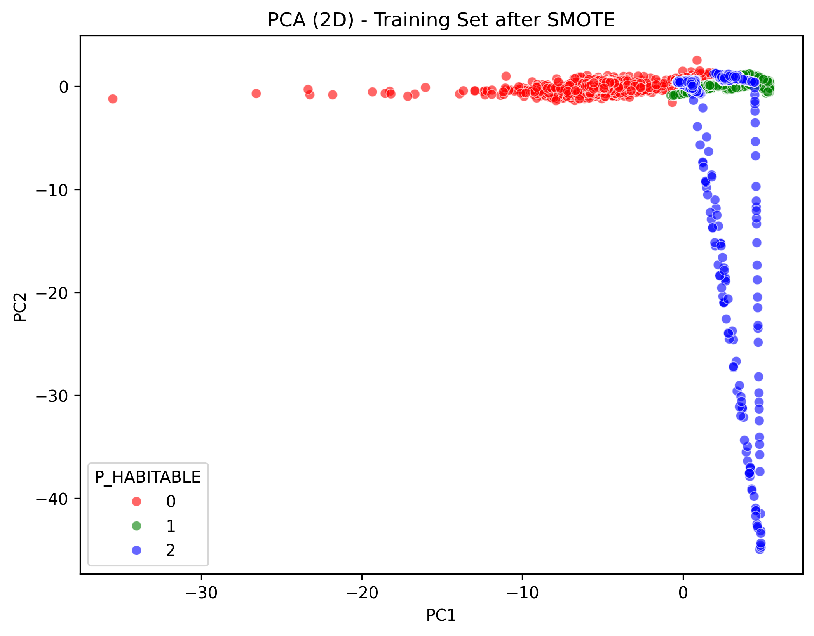
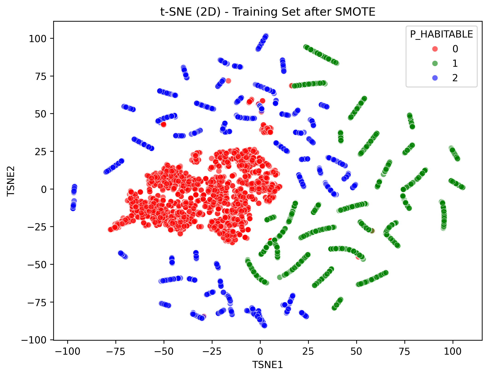

# 🌌 Predicting the Habitability of Exoplanets Using Machine Learning

**Author:** Mohite Swaraj Sanjay  
**Email:** swarajmohite16@gmail.com  
**Live Demo:** [https://exoplanet-swaraj.netlify.app](https://exoplanet-swaraj.netlify.app)  

---

## 📋 Table of Contents
- [Project Overview](#project-overview)  
- [Motivation](#motivation)  
- [Tech Stack](#tech-stack)  
- [Datasets](#datasets)  
- [Features](#features)  
- [Methodology](#methodology)  
- [Machine Learning Models](#machine-learning-models)  
- [Handling Imbalanced Data](#handling-imbalanced-data)  
- [Frontend UI](#frontend-ui)  
- [Backend API](#backend-api)  
- [Visualization](#visualization)  
- [Deployment](#deployment)  
- [Challenges Faced](#challenges-faced)  
- [Future Work](#future-work)  
- [References](#references)  

---

## 🛰 Project Overview
This project predicts the **habitability of exoplanets** using machine learning.  
It analyzes planetary and stellar features to classify planets as:  

- **Habitable**  
- **Partially Habitable**  
- **Not Habitable**  

**Highlights:**  
- Preprocessing and feature engineering  
- Handling class imbalance  
- Dimensionality reduction with PCA and t-SNE  
- Multiple ML models (XGBoost, Random Forest, SVM, etc.)  
- Interactive UI for predictions and visualization  
- Full-stack deployment  

---

## 💡 Motivation
Manual analysis of exoplanets is impractical due to the **massive datasets** and **rare positive cases**.  
Machine learning provides a **fast, accurate, and scalable solution** to identify potentially habitable planets.

---

## 🛠 Tech Stack
- **Frontend:** HTML, CSS, JavaScript  
- **Backend:** Flask (Python)  
- **Machine Learning:** XGBoost, Random Forest, SVM, KNN, Logistic Regression, Naive Bayes  
- **Data Processing:** Pandas, NumPy, Scikit-learn, Imbalanced-learn  
- **Visualization:** Matplotlib, Seaborn, Plotly  
- **Deployment:** Render (Backend), Netlify (Frontend)  

---

## 📊 Datasets
| Dataset | Rows | Columns | Notes | Link |
|---------|------|--------|-------|------|
| PHL Exoplanet Catalog | 4048 | 112 | Target: `P_HABITABLE` (highly imbalanced) | [Kaggle](https://www.kaggle.com/datasets/chandrimad31/phl-exoplanet-catalog) |
| NASA Exoplanet Archive | 39119 | 289 | Official, latest dataset, many missing values | [NASA](https://exoplanetarchive.ipac.caltech.edu/) |
| Kepler Exoplanet Dataset | 9564 | 12 | Missing features, useful for augmentation | [Kaggle](https://www.kaggle.com/datasets/gauravkumar2525/kepler-exoplanet-dataset) |

---

## 🌍 Features
### Planet Features
- Radius, Mass, Density  
- Surface Temperature  
- Orbital Period, Distance from Star  
- Gravity, Orbit Shape  
- Earth-likeness Score  

### Host Star Features
- Star Type, Luminosity, Temperature, Metallicity  

---

## 🧰 Methodology
1. **Data Cleaning & Preprocessing**  
   - Dropped columns with >75% missing values  
   - Imputed numeric values (Median) and categorical values (Mode)  
   - One-hot encoding for categorical features  
   - Standardized numeric features  

2. **Dimensionality Reduction**  
   - PCA and t-SNE for 2D visualization  

3. **Resampling & Class Weighting**  
   - SMOTE, Borderline-SMOTE, SMOTE-Tomek, ADASYN  
   - Random undersampling for majority class  
   - Class-weighted learning with XGBoost and SVM  

4. **Model Training & Evaluation**  
   - Train-test split: 70%-30%  
   - Metrics: Accuracy, Macro F1-score, Minority Class Recall  

---

## 🤖 Machine Learning Models
| Model | Key Points | Metrics |
|-------|------------|--------|
| XGBoost | Scale_pos_weight for imbalance | Macro F1: 0.96, High minority recall |
| Random Forest | Stable performance | Macro F1: 0.71 |
| Balanced Random Forest | Handles imbalance internally | Balanced predictions |
| SVM | Class-weighted | Baseline performance |
| Logistic Regression, KNN, Naive Bayes | Comparison | Lower performance on minority |

---

## ⚖ Handling Imbalanced Data
- Target distribution: 0:3993, 1:21, 2:34  
- Oversampling (SMOTE) may cause overfitting  
- Undersampling loses information  
- Class weighting in XGBoost improves minority class prediction  
- SMOTE-Tomek combines oversampling and noise removal  

---

## 🖥 Frontend UI
Interactive and user-friendly interface:  

- Form-based input for planetary and stellar features  
- Displays predicted habitability class and probability  
- Implemented using HTML, CSS, and JavaScript  

View UI Screenshots

  
  
  

---

## 🔗 Backend API
- Implemented using **Flask**   

---

## 📈 Visualization
- Confusion matrices for all models  
- PCA and t-SNE 2D projections  

View Plots

  
  
  
  
  
  

---

## 🚀 Deployment
- **Backend:** Render  
- **Frontend:** Netlify  
- Live Project: [https://exoplanet-swaraj.netlify.app](https://exoplanet-swaraj.netlify.app)  

---

## ⚠ Challenges Faced
- High class imbalance  
- Overfitting due to oversampling  
- Missing and inconsistent data  
- High-dimensional feature space  
- Integrating ML pipeline with real-time frontend  

---

## 📚 References
1. PHL Exoplanet Catalog: [https://phl.upr.edu/projects/exoplanets-catalog](https://phl.upr.edu/projects/exoplanets-catalog)  
2. NASA Exoplanet Archive: [https://exoplanetarchive.ipac.caltech.edu/](https://exoplanetarchive.ipac.caltech.edu/)  
3. Kepler Exoplanet Dataset: [https://www.kaggle.com/datasets/gauravkumar2525/kepler-exoplanet-dataset](https://www.kaggle.com/datasets/gauravkumar2525/kepler-exoplanet-dataset)  
4. Chawla, N., et al., "SMOTE: Synthetic Minority Over-sampling Technique," Journal of Artificial Intelligence Research, 2002.  
5. XGBoost Documentation: [https://xgboost.readthedocs.io/](https://xgboost.readthedocs.io/) 
